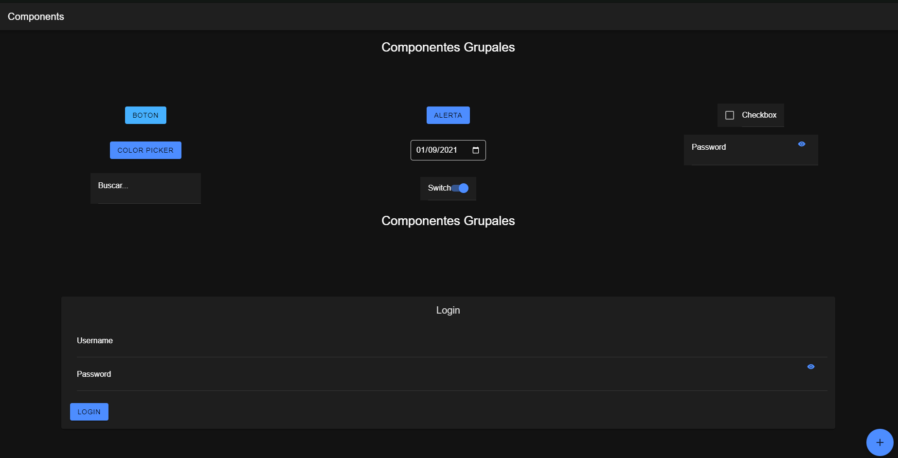

# COMPONENTES INDIVIDUALES

## 1). AlertComponent.tsx

Este componente muestra un botón que, al hacer clic, presenta una alerta con un encabezado, subtítulo y mensaje. La alerta también tiene un botón de cancelar.

```javascript
import React, { useState } from 'react';
import { IonButton, IonAlert } from '@ionic/react';

const AlertComponent: React.FC = () => {
  return (
    <>
      <IonButton id="present-alert">Alerta</IonButton>
      <IonAlert
        trigger="present-alert"
        header="Esta es una alerta"
        subHeader="Subtitulo"
        message="Auto destrucción en 5 segundos"
        buttons={[
          {
            text: 'Cancelar',
            role: 'cancel',
          },
        ]}
      ></IonAlert>
    </>
  );
};

export default AlertComponent;
```

## 2). CustomButton.tsx

Este componente muestra un botón personalizado con texto y color opcional.

```javascript
import React from 'react';
import { IonButton } from '@ionic/react';

interface CustomButtonProps {
  text: string;
  color?: string;
}

const CustomButton: React.FC<CustomButtonProps> = ({ text, color = 'primary' }) => {
  return (
    <IonButton color={color}>
      {text}
    </IonButton>
  );
};

export default CustomButton;
```

## 3). CheckBox.tsx

Este componente muestra un checkbox con una etiqueta de texto.

```javascript
import React from 'react';
import { IonCheckbox, IonLabel, IonItem } from '@ionic/react';

interface CheckBoxProps {
  text: string;
}

const CheckBox: React.FC<CheckBoxProps> = ({ text }) => {
  return (
    <IonItem>
      <IonCheckbox slot="start" />
      <IonLabel>{text}</IonLabel>
    </IonItem>
  );
};

export default CheckBox;
```

## 4). ColorPicker.tsx

Este componente muestra un botón que, al hacer clic, presenta un popover con un selector de color.

```javascript
import React, { useState } from 'react';
import { IonButton, IonPopover } from '@ionic/react';

const ColorPicker: React.FC = () => {
  const [showPopover, setShowPopover] = useState(false);
  const [selectedColor, setSelectedColor] = useState('#000000'); // Color por defecto

  const handleColorChange = (event: React.ChangeEvent<HTMLInputElement>) => {
    const newColor = event.target.value;
    setSelectedColor(newColor);
  };

  return (
    <>
      <IonButton onClick={() => setShowPopover(true)}>Color Picker</IonButton>

      <IonPopover
        isOpen={showPopover}
        onDidDismiss={() => setShowPopover(false)}
      >
        <div style={{ padding: '20px', textAlign: 'center' }}>
          <input
            type="color"
            value={selectedColor}
            onChange={handleColorChange}
            style={{ width: '100%', height: '40px', cursor: 'pointer', border: 'none' }}
          />
          <IonButton onClick={() => setShowPopover(false)} expand="full" style={{ marginTop: '10px' }}>
            Confirm
          </IonButton>
        </div>
      </IonPopover>
    </>
  );
};

export default ColorPicker;
```

## 5). DatePicker.tsx

Este componente muestra un selector de fecha con una fecha seleccionada y una función de cambio de fecha.

```javascript
import React from 'react';

interface DatePickerProps {
  selectedDate: string;
  onDateChange: (date: string) => void;
}

const DatePicker: React.FC<DatePickerProps> = ({ selectedDate, onDateChange }) => {
  return (
    <input
      type="date"
      value={selectedDate}
      onChange={(e) => onDateChange(e.target.value)}
      style={{ padding: '10px', fontSize: '16px', borderRadius: '5px', border: '1px solid #ccc' }}
    />
  );
};

export default DatePicker;
```

## 6). FloatingActionButton.tsx

Este componente muestra un botón de acción flotante que se posiciona en la esquina inferior derecha de la pantalla.

```javascript
import React from 'react';
import { IonFab, IonFabButton, IonIcon } from '@ionic/react';
import { add } from 'ionicons/icons';

interface FloatingActionButtonProps {
  onClick: () => void;
}

const FloatingActionButton: React.FC<FloatingActionButtonProps> = ({ onClick }) => {
  return (
    <IonFab vertical="bottom" horizontal="end" slot="fixed">
      <IonFabButton onClick={onClick}>
        <IonIcon icon={add} />
      </IonFabButton>
    </IonFab>
  );
};

export default FloatingActionButton;
```

## 7). PasswordInput.tsx

Este componente muestra un campo de entrada de contraseña con la opción de mostrar u ocultar la contraseña.

```javascript
import React, { useState } from 'react';
import { IonInput, IonItem, IonLabel, IonButton, IonIcon } from '@ionic/react';
import { eye, eyeOff } from 'ionicons/icons';

interface PasswordInputProps {
  label: string;
  onPasswordChange: (password: string) => void;
}

const PasswordInput: React.FC<PasswordInputProps> = ({ label, onPasswordChange }) => {
  const [showPassword, setShowPassword] = useState(false);

  return (
    <IonItem>
      <IonLabel position="floating">{label}</IonLabel>
      <IonInput 
        type={showPassword ? 'text' : 'password'}
        onIonChange={(e) => onPasswordChange(e.detail.value!)}
      />
      <IonButton fill="clear" slot="end" onClick={() => setShowPassword(!showPassword)}>
        <IonIcon icon={showPassword ? eyeOff : eye} />
      </IonButton>
    </IonItem>
  );
};

export default PasswordInput;
```

## 8). ProgressBar.tsx

Este componente muestra una barra de progreso que se incrementa automáticamente a una velocidad y un incremento especificados.

```javascript
import React, { useState, useEffect } from 'react';
import { IonProgressBar } from '@ionic/react';

interface ProgressBarProps {
  speed: number; 
  increment: number;
}

const ProgressBar: React.FC<ProgressBarProps> = ({ speed, increment }) => {
  const [progress, setProgress] = useState(0);

  useEffect(() => {
    const interval = setInterval(() => {
      setProgress((prevProgress) => {
        if (prevProgress >= 1) {
          return 0; 
        }
        return prevProgress + increment; 
      });
    }, speed);

    return () => clearInterval(interval);
  }, [speed, increment]);

  return (
    <div style={{padding:"20px"}}>
        <IonProgressBar value={progress} />
    </div>
  );
};

export default ProgressBar;
```

## 9). SearchBar.tsx

Este componente muestra una barra de búsqueda con un marcador de posición opcional y una función de búsqueda.

```javascript
import React from 'react';
import { IonItem, IonLabel, IonInput } from '@ionic/react';

interface SearchBarProps {
  placeholder?: string;
  onSearch: (query: string) => void;
}

const SearchBar: React.FC<SearchBarProps> = ({ placeholder = "Search...", onSearch }) => {
  return (
    <IonItem>
      <IonLabel position="floating">{placeholder}</IonLabel>
      <IonInput
        type="text"
        onIonChange={(e) => onSearch(e.detail.value!)} 
      />
    </IonItem>
  );
};

export default SearchBar;
```

## 10). Switch.tsx

Este componente muestra un interruptor con una etiqueta, un estado de verificación y una función de cambio.

```javascript
import React from 'react';
import { IonItem, IonLabel, IonToggle } from '@ionic/react';

interface SwitchProps {
  label: string; 
  isChecked: boolean; 
  onToggle: (checked: boolean) => void;
}

const Switch: React.FC<SwitchProps> = ({ label, isChecked, onToggle }) => {
  return (
    <IonItem>
      <IonLabel>{label}</IonLabel>
      <IonToggle
        checked={isChecked}
        onIonChange={(e) => onToggle(e.detail.checked)}
      />
    </IonItem>
  );
};

export default Switch;
```

# COMPONENTES GRUPALES

## 1). LoginForm.tsx

Este componente muestra un formulario de inicio de sesión con campos para el nombre de usuario y la contraseña, y un botón para enviar el formulario. Utiliza el componente `PasswordInput` para el campo de contraseña y el componente `CustomButton` para el botón de inicio de sesión.

```javascript
import React, { useState } from 'react';
import { IonCard, IonCardHeader, IonCardTitle, IonCardContent, IonItem, IonLabel, IonInput, IonButton } from '@ionic/react';
import PasswordInput from '../password/password';
import CustomButton from '../button/button';

interface LoginFormProps {
  onSubmit: (username: string, password: string) => void;
}

const LoginForm: React.FC<LoginFormProps> = ({ onSubmit }) => {
  const [username, setUsername] = useState('');
  const [password, setPassword] = useState('');

  const handleLogin = () => {
    onSubmit(username, password);
  };

  return (
    <IonCard>
      <IonCardHeader>
        <IonCardTitle style={{ textAlign: 'center' }}>Login</IonCardTitle>
      </IonCardHeader>
      <IonCardContent>
        <IonItem>
          <IonLabel position="floating">Username</IonLabel>
          <IonInput
            type="text"
            value={username}
            onIonChange={(e) => setUsername(e.detail.value!)}
          />
        </IonItem>
        <PasswordInput 
          label="Password" 
          onPasswordChange={setPassword} 
        />
        <br />
        <CustomButton text="Login" color='primary' />
      </IonCardContent>
    </IonCard>
  );
};

export default LoginForm;
```

## 2). ProductCard.tsx

Este componente muestra una tarjeta de producto con el nombre del producto, el precio y un botón para agregar el producto al carrito. Utiliza el componente `CustomButton` para el botón de agregar al carrito.

```javascript
import React from 'react';
import {
  IonCard,
  IonCardHeader,
  IonCardTitle,
  IonCardSubtitle,
  IonCardContent,
  IonButton,
  IonImg
} from '@ionic/react';

import CustomButton from '../button/button';

interface ProductCardProps {
  name: string;         
  price: string;        
  onAddToCart: () => void; 
}

const ProductCard: React.FC<ProductCardProps> = ({ name, price, onAddToCart }) => {
  return (
    <IonCard>

      <IonCardHeader>
        <IonCardTitle>{name}</IonCardTitle>
        <IonCardSubtitle>{price}</IonCardSubtitle>
      </IonCardHeader>
      <IonCardContent>
        <CustomButton text="Add to Cart" color='primary' />
      </IonCardContent>
    </IonCard>
  );
};

export default ProductCard;
```

## 3). SearchFilters.tsx

Este componente muestra un conjunto de filtros de búsqueda con opciones de categoría y ordenación. Utiliza el componente `CustomButton` para el botón de aplicar filtros.

```javascript
import React, { useState } from 'react';
import {
  IonCard,
  IonCardHeader,
  IonCardTitle,
  IonCardContent,
  IonItem,
  IonLabel,
  IonSelect,
  IonSelectOption,
  IonButton,
} from '@ionic/react';
import CustomButton from '../button/button';

interface SearchFiltersProps {
  onApplyFilters: (filters: { category: string; sort: string }) => void; }

const SearchFilters: React.FC<SearchFiltersProps> = ({ onApplyFilters }) => {
  const [category, setCategory] = useState('');
  const [sort, setSort] = useState('');

  const handleApplyFilters = () => {
    onApplyFilters({ category, sort }); 
  };

  return (
    <IonCard>
      <IonCardHeader>
        <IonCardTitle>Filters</IonCardTitle>
      </IonCardHeader>
      <IonCardContent>
        <IonItem>
          <IonLabel>Category</IonLabel>
          <IonSelect value={category} placeholder="Select Category" onIonChange={(e) => setCategory(e.detail.value)}>
            <IonSelectOption value="electronics">Electronics</IonSelectOption>
            <IonSelectOption value="fashion">Fashion</IonSelectOption>
            <IonSelectOption value="home">Home</IonSelectOption>
          </IonSelect>
        </IonItem>

        <IonItem>
          <IonLabel>Sort By</IonLabel>
          <IonSelect value={sort} placeholder="Select Sort" onIonChange={(e) => setSort(e.detail.value)}>
            <IonSelectOption value="recent">Most Recent</IonSelectOption>
            <IonSelectOption value="popular">Most Popular</IonSelectOption>
            <IonSelectOption value="priceAsc">Price: Low to High</IonSelectOption>
            <IonSelectOption value="priceDesc">Price: High to Low</IonSelectOption>
          </IonSelect>
        </IonItem>

        <CustomButton text="Apply Filters" color='primary' />
        
      </IonCardContent>
    </IonCard>
  );
};

export default SearchFilters;
```

# IMPLEMETACIÓN DE COMPONENTES EN LA PÁGINA PRINCIPAL
En este archivo, se importan y utilizan varios componentes creados previamente. A continuación, se describen brevemente las importaciones y el uso de cada componente:

- `AlertComponent`: Muestra un botón que, al hacer clic, presenta una alerta con un encabezado, subtítulo y mensaje.
- `ButtonComponent`: Muestra un botón personalizado con texto y color opcional.
- `CheckBox`: Muestra un checkbox con una etiqueta de texto.
- `ColorPicker`: Muestra un botón que, al hacer clic, presenta un popover con un selector de color.
- `DatePicker`: Muestra un selector de fecha con una fecha seleccionada y una función de cambio de fecha.
- `FabButton`: Muestra un botón de acción flotante que se posiciona en la esquina inferior derecha de la pantalla.
- `PasswordInput`: Muestra un campo de entrada de contraseña con la opción de mostrar u ocultar la contraseña.
- `ProgressBar`: Muestra una barra de progreso que se incrementa automáticamente a una velocidad y un incremento especificados.
- `SearchBar`: Muestra una barra de búsqueda con un marcador de posición opcional y una función de búsqueda.
- `Switch`: Muestra un interruptor con una etiqueta, un estado de verificación y una función de cambio.
- `LoginForm`: Muestra un formulario de inicio de sesión con campos para el nombre de usuario y la contraseña, y un botón para enviar el formulario.
- `SearchFilters`: Muestra un conjunto de filtros de búsqueda con opciones de categoría y ordenación.
- `ProductCard`: Muestra una tarjeta de producto con el nombre del producto, el precio y un botón para agregar el producto al carrito.

Estos componentes se utilizan en la página principal (`Home.tsx`) para mostrar diferentes elementos interactivos y formularios.

```javascript
import { IonContent, IonHeader, IonPage, IonTitle, IonToolbar } from '@ionic/react';
import AlertComponent from '../components/alert/AlertButton';
import ButtonComponent from '../components/button/button';
import CheckBox from '../components/checkbox/CheckBox';
import ColorPicker from '../components/colorpicker/ColorPicker';
import DatePicker from '../components/datepicker/DatePicker';
import FabButton from '../components/fabbutton/FabButton';
import PasswordInput from '../components/password/password';
import ProgressBar from '../components/progressbar/progressbar';
import SearchBar from '../components/search_input/SearchInput';
import Switch from '../components/switch/Switch';
import LoginForm from '../components/grupales/login';
import SearchFilters from '../components/grupales/searchfilters';
import ProductCard from '../components/grupales/productcard';
import './Home.css';

const Home: React.FC = () => {
  return (
    <IonPage>
      <IonHeader>
        <IonToolbar>
          <IonTitle>Components</IonTitle>
        </IonToolbar>
      </IonHeader>
      <IonContent fullscreen>
        
        <h1 style={{ textAlign: 'center' }}>
          Componentes Grupales
        </h1>

        <div className='container'>
          <ButtonComponent
            text="Boton" 
            color="secondary"  
          />
          <AlertComponent />
          <CheckBox 
            text="Checkbox"
          />
          <ColorPicker />
  
          <DatePicker 
            selectedDate='2021-09-01'
            onDateChange={(date) => console.log(date)}
          />

          <FabButton 
            onClick={() => console.log('Fab button clicked')}
          />

          <PasswordInput 
            label="Password"
            onPasswordChange={(password) => console .log(password )}
          />

          <SearchBar 
            placeholder="Buscar..."
            onSearch={(text) => console.log(text)}
          />

          <Switch
            label="Switch"
            isChecked={true}
            onToggle={(checked) => console.log(checked)}
          />
          <ProgressBar
            speed={100}
            increment={0.01}
          />
        </div>

        <h1 style={{ textAlign: 'center' }}>
          Componentes Grupales
        </h1>

        <div style={{ padding: "120px"}}> 
          <LoginForm onSubmit={(data) => console.log(data)} />
        </div>

        <div style={{ padding: "120px"}}> 
          <SearchFilters 
            onApplyFilters={(filters) => console.log(filters)}
          />
        </div>

        <div style={{ padding: "120px"}}> 
          <ProductCard 
            name='Producto 1'
            price = '100'
            onAddToCart={() => console.log('Producto añadido al carrito')} 
          />
        </div>
      </IonContent>
    </IonPage>
  );
};

export default Home;
```

# Imagen de la página principal con los componentes implementados:



# VIDEO DE LA APLICACIÓN FUNCIONANDO

[Video de la aplicación funcionando](https://youtu.be/yyjNuWYS0SM)


